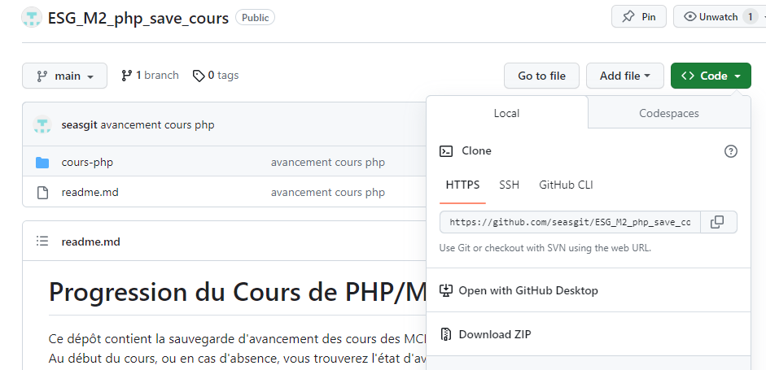
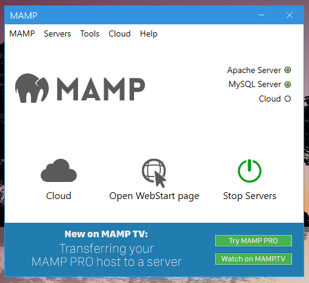
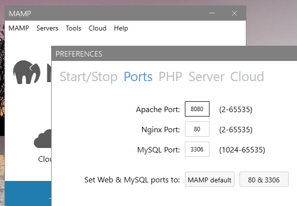
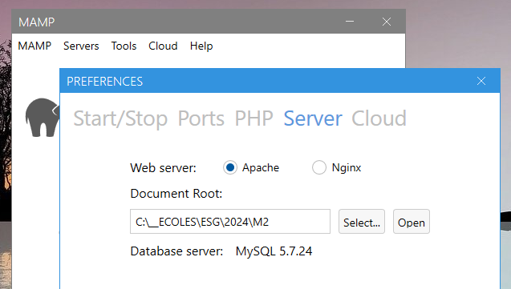

# Memo MAMP et dossier de travail 
Installation avec l'aide de captures d'écran

# 1. Installation du dossier de travail

- On a téléchargé depuis mon espace github le dossier de travail depuis :  https://github.com/seasgit/ESG_M2_php_save_cours
  
- Vous devez ensuite dezipper et place ce dossier dans votre ordinateur à un endroit comme _documents_.

# 2. Installation de MAMP (version gratuite) 
## Depuis le menu 
Sélectionnez _Downloads_   

#
## En bas de l'écran de la page downloads
Sélection d'anciennes versions  

#
## Une fois MAMP installé
Deux voyants sont verts  

#
## Préférences du port
Choisissez 8080 ou 8888 par exemple.  

#
## Préference du document root
- Sélectionnez le dossier de travail que vous avez téléchargé depuis mon espace.  

# 3. Exécution d'une page PHP
- Comme nous l'avons vu en cours, il faut taper dans l'url du navigateur localhost:8080 ( selon le port choisi ).  
  

- Si vous avez des erreurs dans votre programme, exécutez celeui de la sauvegarde que j'ai créé, nous verrons en cours ensuite.